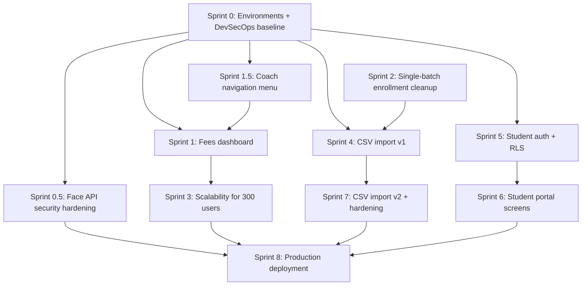
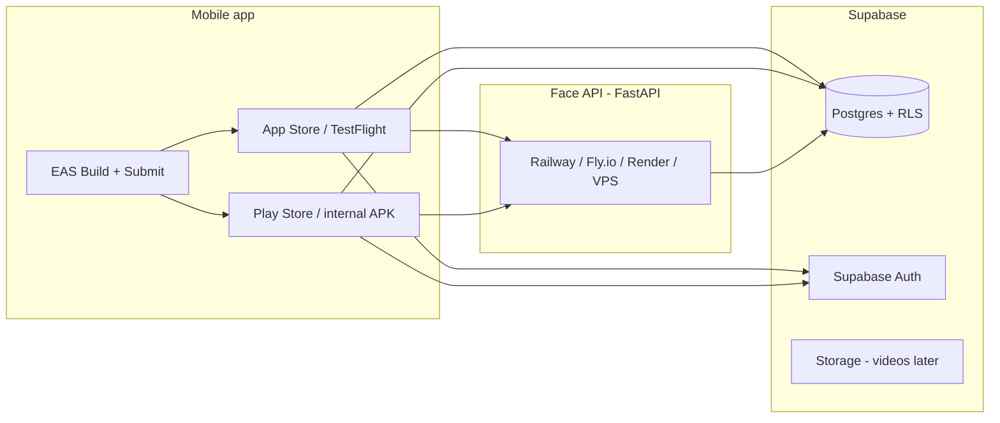

# MCCC Academy App — Sprint Plan

Living document for phased delivery. Update this file as sprints complete, scope changes, or new work is added.

**Last updated:** 2026-07-07

---

## AI vs you — who does what

Most **application code** (screens, components, queries, migration SQL files in the repo) will be implemented by **AI**. All **DevSecOps** work (infrastructure, secrets, deployment, CI/CD setup, security verification in dashboards, load tests) is **your responsibility** so you build hands-on experience.

When you ask AI to implement a sprint, use the prompt template below. AI should **not** create Supabase projects, set EAS/GitHub secrets, deploy hosts, enable Dependabot, or run production migrations — even if it can draft config files, **you** own applying and verifying them.

### Prompt template (copy when starting a sprint)

```text
Implement Sprint [N] from SPRINT_PLAN.md.

Rules:
- Implement only the "AI implements" items for this sprint.
- Do NOT do any "You do — DevSecOps" items (no cloud setup, secrets, CI/CD wiring, deployment, or dashboard config).
- At the end, list what I need to complete manually from the DevSecOps section for this sprint.
- If a feature needs a migration SQL file, write the file in supabase/migrations/ but do not apply it to any remote project.
- If API auth changes are needed, implement the code; I will deploy and verify on staging.
```

### Quick reference — DevSecOps owner per sprint

| Sprint | Your main DevSecOps focus |
|--------|---------------------------|
| **0** | Environments, secrets, CI, API deploy, auth verification |
| **0.5** | HTTPS/WAF, host rate limits, cleartext off in prod builds, scope penetration tests, biometric privacy ops |
| **1.5** | None required (optional: verify menu on staging build) |
| **1** | Apply DB indexes/RPC migration on staging; verify RLS on fees query |
| **2** | Apply optional DB trigger on staging; regression test |
| **3** | Run load tests; rate-limit config on API host; Supabase plan check |
| **4** | Secure import endpoint on staging; test CSV with real file; audit log review |
| **5** | Apply RLS migrations; penetration-style spot checks (student A vs B) |
| **6** | Storage bucket policies; signed URL config; student E2E on staging |
| **7** | SAST tooling; staging import of payment history; pre-launch review |
| **8** | Docker build, API deploy, EAS/TestFlight, App Store review checklist, prod cutover |

---

## Overview

This plan covers the major initiatives discussed for expanding the app beyond a single-academy coach tool:

1. **Coach navigation menu** — unified UI to reach batches, branch switching, fees, admin tools, etc.
2. Academy-wide fees dashboard (pending / overdue / due soon)
3. CSV bulk import with flexible column mapping
4. Student portal (attendance, payments, matches, videos)
5. Single-batch enrollment (remove multi-batch enroll from batch flow)
6. Scalability for ~300 concurrent users
7. Separate dev, staging, and production environments
8. **Deployment pipeline & DevSecOps baseline** (security built in, not bolted on after MVP)
9. **Face API security hardening** (object-level auth, upload limits, audit trail, biometric data handling)
10. **Sprint 8 — Production deployment** (Docker Face API, EAS mobile, TestFlight / store strategy)

**Estimated total timeline:** ~15–19 weeks at a steady pace (sprints can overlap where noted).

---

## Recommended order (dependencies)



**Principle:** Stand up safe environments and security baseline first, add navigation shell so new screens have a home, ship coach-facing value (fees + enrollment rules), harden for scale, then build the student portal on top of new auth.

---

## Sprint summary

| Sprint | Focus | Duration | Depends on | AI code | You — DevSecOps | Status |
|--------|--------|----------|------------|---------|-----------------|--------|
| **0** | Environments + security baseline | 1–2 wk | — | Minimal | **Heavy** | Not started |
| **0.5** | Face API security hardening | 3–5 days | 0 | **Heavy** | **Heavy** | Not started |
| **1.5** | Coach navigation menu | 1 wk | 0 | **Heavy** | Light | Not started |
| **1** | Fees dashboard | 1–2 wk | 0, 1.5 | **Heavy** | Medium | Not started |
| **2** | Single-batch enrollment | 3–5 days | — | **Heavy** | Light | Not started |
| **3** | 300-user scalability | 1–2 wk | 1 | **Heavy** | **Heavy** | Not started |
| **4** | CSV import v1 | 2 wk | 0, 2 | **Heavy** | **Heavy** | Not started |
| **5** | Student auth + RLS | 2 wk | 0 | Medium | **Heavy** | Not started |
| **6** | Student portal UI | 2 wk | 5 | **Heavy** | Medium | Not started |
| **7** | CSV v2 + hardening | 1–2 wk | 4 | **Heavy** | Medium | Not started |
| **8** | Production deployment (Docker + mobile) | 1–2 wk | 0, 3, 7† | Medium | **Heavy** | Not started |

† **Sprint 8 coach-only go-live** can start after Sprints 0, **0.5**, 1.5, 1, 2, 3 (skip 4–7). **Full go-live** (students + CSV) should wait until Sprints 5–7 are done.

‡ **Sprint 0.5** should complete before pointing real users at a **staging** Face API with live student photos. Sprint 3 later tunes rate limits and capacity for ~300 users; 0.5 establishes the security baseline.

---

## Sprint 0 — Environments, release pipeline & security baseline

**Duration:** 1–2 weeks  
**Status:** Not started  
**Goal:** Dev, staging, and production are fully separated; foundational security is in place before wider deployment.

> **Ownership:** This sprint is mostly **your DevSecOps work**. AI only implements the small amount of application code listed below.

### AI implements (ask AI for this only)

| Item | Details |
|------|---------|
| **API auth code** | Add `_require_coach()` (or similar) on `/enroll`, `/check-attendance`, `/branches`, `/batches/{id}`, `/students/{id}` in `server/main.py` |
| **Client token forwarding** | Update `Add_Student.tsx` / `Take_Attendance.tsx` (and shared components) to send `Authorization: Bearer <session.access_token>` to the Face API |
| **Env templates** | Update `client/.env.example` and `server/.env.example` with per-environment variable names documented |
| **Optional scaffold** | Draft `.github/workflows/ci.yml` and `ENVIRONMENTS.md` **content** (you review, commit, and enable) |

**AI must NOT:** create Supabase projects, set secrets, deploy the API, enable GitHub/Dependabot settings, or apply migrations remotely.

### You do — DevSecOps (your tasks)

| # | Task | How / where |
|---|------|-------------|
| 1 | **Create Supabase projects** | Dashboard: `mccc-dev`, `mccc-staging`, `mccc-prod` (or branching for dev/staging) |
| 2 | **Apply migrations** | Run `supabase db push` or SQL Editor for each project; bootstrap admin coach on dev + staging |
| 3 | **Secrets — never in git** | Local `.env` files only; add to `.gitignore`; rotate if ever committed |
| 4 | **EAS Secrets** | `eas secret:create` per profile: `EXPO_PUBLIC_SUPABASE_URL`, `EXPO_PUBLIC_SUPABASE_ANON_KEY`, `EXPO_PUBLIC_API_BASE_URL` |
| 5 | **Server env on host** | Set `SUPABASE_URL`, `SUPABASE_KEY` (secret key), `SUPABASE_ANON_KEY`, `DEBUG_ENROLL_IMAGES=0` on staging/prod |
| 6 | **Deploy Face API** | Railway / Fly.io / Render / VPS with **HTTPS**; point staging app at staging API URL |
| 7 | **Verify API auth** | `curl` without token → 401; with coach JWT → 200 on `/enroll` test |
| 8 | **HTTPS / cleartext** | Prod API TLS only; keep `usesCleartextTraffic` for dev builds only |
| 9 | **GitHub Actions** | Create `.github/workflows/ci.yml`; require pass on PR |
| 10 | **Dependabot** | GitHub → Settings → Security → enable for `client/` and `server/` |
| 11 | **RLS review** | Supabase Dashboard → Advisors → security; fix or document findings |
| 12 | **Document** | Fill in `ENVIRONMENTS.md` with real project URLs and reset procedures |

### Joint acceptance criteria

**AI / app code**
- [ ] Client sends coach JWT to Face API on enroll and attendance
- [ ] Unauthenticated API calls return 401 (verify after you deploy)

**You — infrastructure**
- [ ] Local dev hits **dev** Supabase only
- [ ] Staging build hits **staging** Supabase + staging API (HTTPS)
- [ ] Production project exists (can stay empty until launch)
- [ ] Staging can be wiped/reseeded without affecting prod
- [ ] `DEBUG_ENROLL_IMAGES=0` on staging/prod API host
- [ ] GitHub Actions CI runs on PRs
- [ ] Dependabot enabled

### Notes

_Record project URLs, API host URLs, and EAS profile names here._

---

## Sprint 0.5 — Face API security hardening

**Duration:** 3–5 days  
**Status:** Not started  
**Depends on:** Sprint 0 (JWT auth on Face API routes + staging API deployed)  
**Goal:** Close the highest-risk gaps in the facial-recognition pipeline before coaches use staging with real student photos — without waiting for full scale work (Sprint 3).

> **Context:** Sprint 0 adds *authentication* (valid coach JWT). This sprint adds *authorization* (coach may only act on valid students/batches), *abuse controls*, *biometric data hygiene*, and *auditability*. Embeddings in `student_auth` are sensitive even though raw photos are not stored in Supabase.

### AI implements (ask AI for this only)

| Item | Details |
|------|---------|
| **Object-level authorization** | After `_require_coach()`, verify on `/enroll` and `/check-attendance`: `student_id` exists and is active; for attendance, `student_id` is in `batch_members` for the submitted `batch_id`. Return **403** when out of scope. |
| **Scope helper** | Add `_require_coach_can_act_on_student()` (and batch check) in `server/main.py`; prefer Supabase RPC if one exists, else server query using coach JWT context |
| **Enroll batch context** | Pass `batch_id` from `Add_Student` / `AddStudentScreen` enroll flow so enroll can verify batch membership (not only attendance) |
| **Upload limits** | Max body / file size (e.g. 5 MB), allowed MIME types (`image/jpeg`, `image/png`, `image/webp`); reject oversize or non-images with **413** / **400** |
| **In-app rate limit (optional)** | Lightweight per-IP or per-token throttle middleware on `/enroll` and `/check-attendance` in FastAPI (defense in depth; host limits are still required) |
| **Audit log migration** | SQL in `supabase/migrations/`: `face_api_audit_log` (coach `auth_user_id`, action, `student_id`, `batch_id`, timestamp, client IP if available, success/failure — **no image bytes**) |
| **Audit writes** | Insert audit rows from server on enroll / attendance success and on auth/scope failures |
| **`student_auth` RLS migration** | Ensure mobile clients cannot read/write `face_embedding` directly; only service-role backend paths |
| **Production cleartext guard** | `app.config.js`: `usesCleartextTraffic` only when `process.env.APP_VARIANT === 'development'` (or equivalent); document EAS profile env |
| **Health endpoint** | `GET /health` (no auth) for load balancers — no sensitive data in response |
| **Docs** | Short `server/SECURITY.md` summarizing threat model, what is stored, and env flags (`DEBUG_ENROLL_IMAGES`, etc.) |

**AI must NOT:** enable WAF, configure Cloudflare/host rate limits, write privacy policy text for the academy, deploy API, or apply migrations remotely.

### You do — DevSecOps (your tasks)

| # | Task | How / where |
|---|------|-------------|
| 1 | **Apply migrations** | Run new audit + `student_auth` RLS migrations on **dev**, then **staging** |
| 2 | **`DEBUG_ENROLL_IMAGES=0`** | Confirm on staging/prod API host; delete any existing `server/debug_enroll/` files on those hosts |
| 3 | **HTTPS only** | Staging/prod `EXPO_PUBLIC_API_BASE_URL` must be `https://`; verify no HTTP in preview/production EAS profiles |
| 4 | **Disable cleartext (prod builds)** | EAS `preview` / `production`: set `APP_VARIANT` (or equivalent) so Android cleartext is off; rebuild and smoke-test |
| 5 | **WAF / edge protection** | Put API behind Cloudflare (or host WAF): TLS, bot fight mode, geo block if needed |
| 6 | **Host rate limits** | Configure on Fly/Railway/Cloudflare: e.g. 20–30 req/min per IP on `/enroll` and `/check-attendance` (tune in Sprint 3) |
| 7 | **Scope penetration test** | On staging: Coach A token + Coach B's `student_id` → expect **403**; valid student in batch → **200** |
| 8 | **Auth regression** | No token → **401**; expired JWT → **401**; suspended coach → **403** (if test account exists) |
| 9 | **RLS advisor** | Supabase Dashboard → Advisors → Security; confirm `student_auth` not exposed to `authenticated` role |
| 10 | **Biometric privacy ops** | Parent/student consent process for face enrollment; document delete/re-enroll when student leaves (ops, not code) |
| 11 | **Logging hygiene** | API host logs: no request body / image logging in staging/prod |
| 12 | **Audit log review** | After test enroll/attendance, query `face_api_audit_log` on staging; confirm rows without PII images |

### Problem today

| Gap | Risk |
|-----|------|
| `_require_coach()` only checks role, not student/batch | Any approved coach could enroll or mark attendance for arbitrary `student_id` values |
| Raw photos sent to API; debug save enabled by default locally | Biometric data exposure on disk or over HTTP in non-dev builds |
| No upload size/type limits | DoS via large uploads; CPU exhaustion on face endpoints |
| Service-role server bypasses RLS | API layer must enforce scope; DB policies must block direct client access to embeddings |
| No audit trail | Cannot investigate who enrolled or marked attendance for a student |

### Joint acceptance criteria

**AI / app code**
- [ ] `/enroll` and `/check-attendance` return **403** when `student_id` is not in the submitted batch (or student inactive)
- [ ] Oversize or non-image uploads rejected
- [ ] `GET /health` returns 200 without auth
- [ ] Enroll flow sends `batch_id` for scope validation
- [ ] Audit migration file exists in repo (you apply on staging)
- [ ] Production EAS build config supports cleartext-off (code + profile env)

**You — infrastructure**
- [ ] Staging API is HTTPS-only; `DEBUG_ENROLL_IMAGES=0`
- [ ] Host rate limits active on face endpoints
- [ ] WAF or equivalent edge protection in front of API URL
- [ ] Coach A vs Coach B scope test documented (pass/fail notes)
- [ ] `student_auth` not readable from Supabase client with coach JWT alone
- [ ] Consent / retention process documented for academy staff

### Out of scope (later)

- **On-device embedding** (photo never leaves phone) — consider post-MVP privacy upgrade
- **Certificate pinning** — optional; HTTPS + proper TLS usually sufficient first
- **300-user load tuning** — Sprint 3
- **Narrow DB role** replacing full service-role key — post-MVP hardening

### Notes

_Record scope test results, rate-limit thresholds, and consent doc link here._

---

## Sprint 1.5 — Coach navigation menu (app shell)

**Duration:** ~1 week  
**Status:** Not started  
**Depends on:** Sprint 0 (recommended)  
**Goal:** A persistent in-app menu so coaches/admins can reach all major areas without deep back-navigation or re-login.

### AI implements

| Item | Details |
|------|---------|
| **Menu component** | Drawer, slide-over panel, or top nav — landscape-friendly for tablet use |
| **Persistent access** | Available from all coach `(tabs)` screens after login (not on auth-only screens) |
| **Menu entries** | See table below |
| **Branch switcher** | Change active branch without logging out; updates `Batch_Screen` context |
| **Active context** | Show current branch (and optional batch) in menu header |
| **Role-aware items** | Hide admin-only links for non-admin coaches |
| **Logout** | Sign out + return to login |
| **Branch context** | React context or global state for `branch_id` / `branch_name` |

**AI must NOT:** configure EAS builds, env vars, or deployment.

### You do — DevSecOps

| # | Task |
|---|------|
| 1 | Smoke-test menu on **staging** EAS preview build (optional if still on local dev only) |
| 2 | Confirm admin vs coach menu visibility with two test accounts on staging |
| 3 | No infrastructure changes required if Sprint 0 staging is already up |

### Problem today

Navigation is mostly linear: login → pick branch once → `Batch_Screen` → `Batch` → individual screens. There is no global way to switch branches, jump to fees, or reach admin tools from anywhere in the app.

### Work items

| Item | Details |
|------|---------|
| **Menu component** | Drawer, slide-over panel, or top nav — landscape-friendly for tablet use |
| **Persistent access** | Available from all coach `(tabs)` screens after login (not on auth-only screens) |
| **Menu entries** | See table below |
| **Branch switcher** | Change active branch without logging out; updates `Batch_Screen` context |
| **Active context** | Show current branch (and optional batch) in menu header |
| **Role-aware items** | Hide admin-only links for non-admin coaches |
| **Logout** | Sign out + return to login |

### Menu structure (coach / admin)

| Menu item | Route / action | Availability |
|-----------|----------------|--------------|
| **Home** | `/(tabs)` or dashboard | All coaches |
| **Switch branch** | Branch picker → `Batch_Screen` | All coaches |
| **Batches** | `Batch_Screen` for current branch | All coaches |
| **Fees** | `Fees.tsx` (Sprint 1) | All coaches |
| **Coach requests** | `Coach_Requests` | Admin only |
| **Manage coaches** | `Manage_Coaches` | Admin only |
| **Import data** | `Import_Data` (Sprint 4) | Admin only — stub or hide until ready |
| **Settings** | Optional: change password, app version, env indicator (dev/staging) | All coaches |
| **Log out** | Clear session → `/login` | All coaches |

### Implementation notes

- Consider `expo-router` drawer layout or a shared `CoachMenu` component included in screen headers
- Store selected `branch_id` / `branch_name` in React context or lightweight global state so branch switch propagates
- Student portal (Sprint 6) will need a **separate** student menu — do not mix coach and student nav in the same shell

### Acceptance criteria

- [ ] Coach can open menu from any main app screen
- [ ] Coach can switch branches from the menu without re-authenticating
- [ ] Coach can navigate to batches list from the menu
- [ ] Fees entry appears in menu (links to fees screen when Sprint 1 is done; can show “Coming soon” stub earlier)
- [ ] Admin-only items hidden for non-admin coaches
- [ ] Logout works from menu

### Notes

_Design preference (drawer vs top nav), mockups, and component file paths here._

---

## Sprint 1 — Academy fees dashboard

**Duration:** 1–2 weeks  
**Status:** Not started  
**Depends on:** Sprint 0, Sprint 1.5  
**Goal:** A dedicated fees page for coaches/admins showing all pending fees, with **overdue** and **due soon** highlighting.

### AI implements

| Item | Details |
|------|---------|
| **New screen** | `Fees.tsx` (or `Pending_Fees.tsx`) — list all unpaid/partial invoices |
| **Query / RPC** | Client query or migration file for `list_pending_fees` RPC |
| **Status logic** | Overdue / due soon highlighting and sort order |
| **UI** | Student name, branch, batch, amount, due date, balance |
| **Actions** | Tap row → `Student_Profile` or quick “record payment” |
| **Navigation** | Wire into coach menu (Sprint 1.5) |
| **Migration file** | Indexes on `invoices` if needed — SQL in `supabase/migrations/` only |

**AI must NOT:** apply migrations to Supabase; configure RLS in dashboard without migration files.

### You do — DevSecOps

| # | Task |
|---|------|
| 1 | **Review migration** AI wrote; apply to **staging** first, then prod when ready |
| 2 | **RLS check** — run fees query as coach JWT in Supabase SQL editor / app; confirm no data leak across roles |
| 3 | **Security advisor** — re-run after new migration |
| 4 | **Performance** — if list is slow on staging with seed data, note for Sprint 3 |

### Work items (reference)

| Item | Details |
|------|---------|
| **New screen** | `Fees.tsx` (or `Pending_Fees.tsx`) — list all unpaid/partial invoices for current billing period |
| **Query** | Join `invoices` + `students` + `branches`; filter `status IN ('unpaid', 'partial')` |
| **Status logic** | Use `due_date` from `invoices` + `fee_policies.due_day_of_month`: **overdue** = past due, **due soon** = within 3 days (configurable) |
| **UI** | Sort: overdue first → due soon → rest; show student name, branch, batch, amount, due date, balance |
| **Actions** | Tap row → `Student_Profile` or quick “record payment” |
| **Navigation** | Linked from coach menu (Sprint 1.5) |

### DB work (light)

- Index on `(billing_year, billing_month, status)` and `due_date` if queries are slow
- Optional RPC `list_pending_fees(branch_id?, as_of_date)` for one round-trip

### Acceptance criteria

- [ ] Admin sees all pending fees across branches in one view
- [ ] Overdue rows are visually distinct from due-soon rows
- [ ] Tapping a row opens the student’s fee detail / payment flow
- [ ] Fees screen reachable from coach navigation menu

### Notes

_Billing already exists on `Student_Profile`; this sprint adds the academy-wide aggregate view._

---

## Sprint 2 — Single-batch enrollment cleanup

**Duration:** 3–5 days  
**Status:** Not started  
**Goal:** Students are enrolled in **one batch only** at registration; remove ad-hoc multi-batch enrollment from the batch flow.

### AI implements

| Item | Details |
|------|---------|
| **Remove batch enroll UI** | `EnrollStudentModal` batch path on `Student_Profile` |
| **Register flow** | Require `batch_id` when registering from a batch |
| **Transfer flow** | Optional admin-only “Move to another batch” UI |
| **Batch page** | Keep Register + Initialize face only |
| **Optional migration** | One-batch-per-student trigger SQL file (if agreed) |

**AI must NOT:** run data migration on prod; you decide how to handle existing multi-batch rows.

### You do — DevSecOps

| # | Task |
|---|------|
| 1 | **Data audit** — query `batch_members` for students in multiple batches before UI goes live |
| 2 | **Apply optional DB trigger** on staging; test transfer flow |
| 3 | **Regression test** on staging: register → single batch → attendance still works |

### Work items (reference)

| Item | Details |
|------|---------|
| **Remove** | `EnrollStudentModal` “Add enrollment” for **batches** on `Student_Profile` (keep fee-plan/custom-day if still needed, or restrict per product rules) |
| **Register flow** | `Register_Student` already enrolls via `batch_id` param — make `batch_id` **required** when registering from a batch |
| **Transfer flow** | Optional: “Move to another batch” (admin-only) instead of “add another batch” |
| **DB guard** | Optional: enforce one active batch per student via trigger or app rule (schema currently allows multi-batch via `batch_members`) |
| **Batch page** | Keep **Register student** + **Initialize face**; no separate “enroll existing student” action |

### Acceptance criteria

- [ ] No UI path to add a student to a second batch without an explicit transfer
- [ ] New students from a batch page land in that batch only
- [ ] Existing multi-batch data handled (migrate or grandfather)

### Notes

---

## Sprint 3 — Scalability for ~300 concurrent users

**Duration:** 1–2 weeks  
**Status:** Not started  
**Depends on:** Sprint 1  
**Goal:** App stays responsive if ~300 members use it at once (worst case).

> **Note:** Sprint **0.5** establishes baseline Face API rate limits and security controls. This sprint **tunes** those limits and instance sizing using load-test data.

### AI implements

| Item | Details |
|------|---------|
| **Pagination / virtualization** | `Batch.tsx`, `Batch_Screen`, fees dashboard |
| **Query optimization** | Efficient Supabase selects; avoid N+1 |
| **Migration files** | Index SQL for `batch_members`, `attendance`, `invoices` |
| **Client caching** | Short TTL cache for branches/batches |
| **Load test script** | k6 or Artillery script in repo (you run it) |

**AI must NOT:** upgrade Supabase plan, configure rate limits on host, or run load tests against prod.

### You do — DevSecOps

| # | Task |
|---|------|
| 1 | **Apply index migrations** on staging |
| 2 | **Run load test** AI provides against **staging**; record p95 latency in Notes |
| 3 | **Rate limiting** — **tune** limits from Sprint 0.5 baseline using load-test results (API host / Cloudflare) |
| 4 | **Supabase plan** — check connection limits; upgrade if load test fails |
| 5 | **Face API scaling** — document max concurrent requests; scale instance if needed |
| 6 | Define pass/fail thresholds (e.g. p95 &lt; 3s) and sign off |

### Work items (reference)

| Area | Work |
|------|------|
| **Lists** | Pagination / virtualized lists on `Batch.tsx`, `Batch_Screen`, fees dashboard (e.g. 50 per page) |
| **Queries** | Audit Supabase selects; add indexes on `batch_members(batch_id)`, `attendance(student_id, date)`, `invoices(student_id, billing_year, billing_month)` |
| **N+1** | Batch student fetch already one query — keep that pattern everywhere |
| **Face API** | Document concurrent `/enroll` and `/check-attendance` limits; rate limit if many simultaneous camera scans (DevSecOps Phase B) |
| **Supabase plan** | Confirm connection limits and upgrade if needed |
| **Load test** | Script (k6 or Artillery) simulating 300 concurrent reads against staging |
| **Caching** | Short TTL cache for branches/batches (rarely change) |

### Acceptance criteria

- [ ] Batch student list loads in <2s with 300 students (paginated)
- [ ] Fees dashboard handles 300+ open invoices without timeout
- [ ] Load test on staging passes agreed thresholds (define: e.g. p95 < 3s for list endpoints)

### Notes

_Define exact load-test thresholds and record results here._

---

## Sprint 4 — CSV import v1

**Duration:** 2 weeks  
**Status:** Not started  
**Depends on:** Sprint 0, Sprint 2  
**Goal:** Admins can upload a CSV and bulk-create branches, batches, students, and enrollments.

### AI implements

| Item | Details |
|------|---------|
| **Admin screen** | `Import_Data.tsx` — file picker, preview, column mapping UI |
| **Import engine** | Server route or Edge Function code (service role from env) |
| **Validation & dry run** | Preview mode, row errors, commit mode |
| **Audit log table** | Migration SQL for `import_audit_log` (or similar) |
| **Menu link** | Admin-only entry in coach menu |

**AI must NOT:** deploy Edge Function to Supabase; set service role secrets; import real CSV to prod.

### You do — DevSecOps

| # | Task |
|---|------|
| 1 | **Deploy import endpoint** on staging API with service role key in host env only |
| 2 | **Lock down route** — verify non-admin JWT gets 403 |
| 3 | **Test with real CSV** on **staging** only; never first-run on prod |
| 4 | **Apply audit log migration** on staging |
| 5 | **Review imported data** — spot-check students, batches, RLS still holds |
| 6 | **Backup staging** before large import tests (or use reset script from Sprint 0) |

### Work items (reference)

| Item | Details |
|------|---------|
| **Admin screen** | `Import_Data.tsx` — file picker, preview first 10 rows |
| **Column mapping UI** | Map CSV headers → canonical fields (`first_name`, `branch_name`, `batch_name`, etc.) |
| **Import engine** | Supabase Edge Function or `server` route (service role) — runs import in FK order |
| **Validation** | Row-level errors: missing branch, bad gender, duplicate phone, invalid date |
| **Dry run** | “Preview import” — no writes, show what would be created |
| **Commit** | Transactional batches; rollback on critical failure; error report downloadable |
| **v1 scope** | Students + batch membership + branches/batches auto-create by name. **Defer** payments/attendance history to v2 |
| **Security** | Admin-only + service role; audit log (who imported, when); dry-run on staging first |
| **Navigation** | Linked from coach menu (admin only) |

### Import order (foreign keys)

```
1. branches
2. fee_plan_templates (if batches use fee plans)
3. batches
4. batch_schedule
5. students
6. batch_members
7. student_custom_plans / student_fee_plan_enrollments (if applicable)
8. invoices + line items (v2 — or use refresh_student_billing RPC)
9. payments (v2)
10. attendance (v2)
11. student_auth — skip; re-capture faces in app
```

### Format edge cases (v1)

- Combined name → split first/last
- `M` / `F` / `Male` / `Female` → `boy` / `girl`
- Multiple date formats
- Branch/batch as text → lookup or create
- Extra columns ignored
- Empty rows skipped

### Acceptance criteria

- [ ] Upload real MCCC CSV on **staging**, verify students appear in correct batches in the app
- [ ] Mapping saved as template for reuse
- [ ] Failed rows reported without breaking successful rows
- [ ] Import reachable from admin menu

### Notes

_Paste CSV column headers and mapping decisions here when available._

---

## Sprint 5 — Student auth & data access

**Duration:** 2 weeks  
**Status:** Not started  
**Depends on:** Sprint 0  
**Goal:** Students (or parents) can log in and only see **their own** data.

> **Scope change:** Current `scope.md` says “No student/parent login for now.” This sprint implements that capability.

### AI implements

| Item | Details |
|------|---------|
| **Schema migration files** | Link `students` to `auth.users`; any helper tables |
| **RLS policy SQL** | Student-scoped read policies in migration files |
| **App routing** | Role gate in `_layout.tsx`: coach vs student stacks |
| **Student login UI** | Login / invite flow screens |
| **Provisioning hooks** | Admin invite or CSV-generated invite codes (app code) |

**AI must NOT:** enable auth providers in Supabase Dashboard; create auth users in prod; apply RLS without your review.

### You do — DevSecOps

| # | Task |
|---|------|
| 1 | **Product decision** — parent vs student vs magic link (document in Notes) |
| 2 | **Supabase Auth settings** — email/phone provider, confirm-email off if using temp passwords |
| 3 | **Review every RLS policy** AI writes before applying to staging |
| 4 | **Apply migrations** staging → verify → prod |
| 5 | **Isolation test** — two student accounts; confirm A cannot read B’s data (API + app) |
| 6 | **Security advisor** — full pass after student policies added |
| 7 | **Coach regression** — approved coach access unchanged |

### Work items (reference)

| Item | Details |
|------|---------|
| **Product decision** | Parent login vs student login vs magic link by phone |
| **Auth** | Supabase Auth: link `students` to `auth.users` (new table or extend `students`) |
| **RLS** | New policies: students read own `attendance`, `payments`, `invoices`, `media`, `batch_members` |
| **App routing** | Role gate in `_layout.tsx`: coach stack vs student stack (separate nav from coach menu) |
| **Provisioning** | Admin invites student (phone/email) or auto-create on CSV import with invite code |

### Acceptance criteria

- [ ] Student A cannot see Student B’s attendance or payments (verified in staging)
- [ ] Coach/admin flows unchanged
- [ ] At least one test student account works end-to-end

### Notes

---

## Sprint 6 — Student portal screens

**Duration:** 2 weeks  
**Status:** Not started  
**Depends on:** Sprint 5  
**Goal:** Student-facing views for self-service access.

### AI implements

| Item | Details |
|------|---------|
| **Student screens** | Home, attendance, payments, matches, videos |
| **Student menu** | Separate nav shell from coach menu |
| **Export** | Attendance download (CSV/PDF generation in app) |
| **Media playback** | Client code for signed URL video access |

**AI must NOT:** create Storage buckets, set bucket policies, or configure CORS in Supabase Dashboard.

### You do — DevSecOps

| # | Task |
|---|------|
| 1 | **Supabase Storage** — create bucket(s) for match/batch video |
| 2 | **Bucket RLS / policies** — students read only their linked media |
| 3 | **Signed URL TTL** — choose expiry; test download on staging |
| 4 | **Student E2E on staging** — login → attendance → payment → video |
| 5 | **Export privacy** — confirm exported files contain only that student’s data |

### Screens (reference)

| Screen | Features |
|--------|----------|
| **Home** | Upcoming batches/sessions, next match |
| **Attendance** | History list; **download** as CSV/PDF |
| **Payments** | Payment history + current balance (read-only) |
| **Matches** | Upcoming matches; link to `matches` table |
| **Videos** | Match/batch videos from `media` (Supabase Storage signed URLs) |

### Student navigation menu (separate from coach menu)

| Menu item | Route |
|-----------|-------|
| Home | Student dashboard |
| My batches | Upcoming sessions |
| Attendance | History + export |
| Payments | Balance + history |
| Matches & videos | Media gallery |

### Acceptance criteria

- [ ] Student can view and export attendance history
- [ ] Student can watch/download match videos they’re allowed to see
- [ ] Student sees upcoming batches and matches
- [ ] Student nav is separate from coach nav (no cross-access)

### Notes

_Existing coach screens: `Student_Payment_History.tsx`, `Student_Attendance_History.tsx` — may be reused or adapted for student role._

---

## Sprint 7 — CSV import v2 + platform hardening

**Duration:** 1–2 weeks  
**Status:** Not started  
**Depends on:** Sprint 4  
**Goal:** Handle messy CSVs and optional historical data; prepare for multi-academy use.

### AI implements

| Item | Details |
|------|---------|
| **Mapping templates** | Save/load column presets in app + DB |
| **Payment & attendance import** | Extended import engine logic |
| **Duplicate detection** | Match on phone + name + DOB |
| **Multi-academy schema** | `academy_id` migration files if proceeding |

**AI must NOT:** enable CodeQL/Semgrep in GitHub (you do); run pen test; import payment history to prod.

### You do — DevSecOps

| # | Task |
|---|------|
| 1 | **SAST** — enable CodeQL or Semgrep on repo (Phase C) |
| 2 | **Payment import test** on staging — reconcile with billing RPC |
| 3 | **Import audit review** — who imported what, when |
| 4 | **Pre-multi-academy review** — RLS + tenant isolation sign-off before other academies |
| 5 | Optional **pen test** or checklist review before external customers |

### Work items (reference)

| Item | Details |
|------|---------|
| **Saved mapping templates** | Per-academy column presets |
| **Payment history import** | Map to `invoices` + `payments` (validate against billing RPC) |
| **Attendance history** | Optional bulk `attendance` rows |
| **Duplicate detection** | Match on phone + name + DOB |
| **Import audit log** | Who imported, when, row counts |
| **Multi-academy prep** | If selling to other academies: `academy_id` + tenant isolation |
| **DevSecOps Phase C** | CodeQL/Semgrep on PRs; optional pen test before multi-academy launch |

### Acceptance criteria

- [ ] Second CSV format works via saved mapping template
- [ ] Payment import reconciles with fee engine or flags manual review rows

### Notes

---

## Sprint 8 — Production deployment (Docker + mobile distribution)

**Duration:** 1–2 weeks  
**Status:** Not started  
**Depends on:** Sprint 0, Sprint **0.5**, Sprint 3 (minimum); Sprint 7 + 6 for full platform launch  
**Goal:** Containerize the Face API, deploy all production infrastructure, and ship the mobile app to real users with a clear distribution strategy.

> **Ownership:** AI drafts Docker/CI config and app tweaks; **you** build images, deploy hosts, run EAS submits, and manage Apple/Google accounts.

---

### Recommended deployment strategy (read before building)

This app has **three parts** — only **one** should be Dockerized:

| Component | Deploy how | Docker? |
|-----------|------------|---------|
| **Mobile app (Expo)** | **EAS Build** + **EAS Submit** | No — stores/binaries, not containers |
| **Database + Auth** | **Supabase Cloud** (managed) | No — do not self-host Postgres for this project |
| **Face API (FastAPI)** | **Docker** on Fly.io / Railway / Render | **Yes** |

#### Face API — recommended host: **Fly.io** (primary) or **Railway** (simpler)

| Option | Why |
|--------|-----|
| **Fly.io** (recommended) | Native Docker, automatic HTTPS, health checks, easy scale-up for CPU-heavy `face_recognition` / dlib |
| **Railway** | Very simple Dockerfile deploy; good if you want minimal ops |
| **Render** | Fine for MVP; cold starts can hurt attendance peaks |
| **AWS ECS / Cloud Run** | More control; steeper learning curve — good DevSecOps practice if you want it |

`face_recognition` needs a proper image (cmake, dlib compile or prebuilt wheels). AI can author the `Dockerfile`; **you** build, push, and deploy.

#### Mobile — TestFlight vs App Store (honest take)

**Your idea (TestFlight + link to users) is the right call for the coach MVP** — not because the App Store is impossible, but because you have a **small, known user list** (coaches/admins on academy tablets/phones).

| Approach | Best for | Pros | Cons |
|----------|----------|------|------|
| **TestFlight — internal** (≤100 testers) | First coach beta | No beta review; fast | Testers must be App Store Connect users |
| **TestFlight — external** (≤10,000) | Coach rollout (~5–30 people) | Public invite link; still not full App Store | **Builds expire after 90 days**; users need TestFlight app; Apple beta review |
| **App Store + Play Store** | Students/parents (~300), public academies | Install like any app; no 90-day expiry | $99/yr Apple + Google Play fee; privacy labels; review wait |
| **EAS internal (Android APK link)** | Android coaches | No Play Store needed | Users must allow “install unknown apps”; less polished |
| **Student web portal (future)** | 300+ students, read-only views | No store friction for parents | Separate build; not native; camera/face features stay in coach app |

**Recommendation — phased rollout:**

1. **Coach MVP (now → ~30 users):**  
   - **iOS:** EAS `production` build → **TestFlight external** → share invite link with coaches  
   - **Android:** EAS **internal distribution** APK or Play **internal testing** track  
   - Supabase **prod** + Docker Face API on **Fly.io** with HTTPS  

2. **Student portal (300 users, Sprint 5–6):**  
   - **Do not rely on TestFlight alone** — re-inviting 300 people every 90 days and making everyone install TestFlight does not scale.  
   - **Plan App Store + Play Store** for the student app, **or** ship student features as a **web app** (Supabase + responsive UI) while coaches keep the native app for face attendance.  

3. **App Store is not “harder” forever** — initial setup (Developer account, App Privacy, screenshots) is a one-time lift. EAS Submit automates upload. For a closed academy product, TestFlight carries you for **months** on the coach side only.

**Do not use Expo Go in production.** Always use EAS development/preview/production builds.

#### Apple membership — same fee for TestFlight and App Store

| Question | Answer |
|----------|--------|
| Cost | **$99 USD / year** (Apple Developer Program) |
| TestFlight only? | Same $99 — not a separate product |
| App Store only? | Same $99 |
| Pay only when updating? | **No** — membership must stay **active** to keep the app listed, distribute builds, and submit updates |
| TestFlight build expiry | Every build expires **90 days after upload** (not tied to user count); upload a new build before expiry |

#### Approval outlook (MCCC Academy, Oman)

Geography is **not** a barrier — the App Store is available in Oman. Academy/coach tools are a **normal** category. Face/camera for attendance is **allowed** with clear privacy disclosure.

| Preparation | Rough first-submit approval odds |
|-------------|----------------------------------|
| Well prepared (checklist below) | **~70–85%** |
| Rushed (no demo login, HTTP API, no privacy policy) | **~30–50%** |
| After one rejection + fixes | **Very high** |

---

### App Store & TestFlight review checklist (you — DevSecOps)

Complete before **TestFlight external** beta review or **App Store** submission. TestFlight external is a good dress rehearsal for full App Store review.

#### A. Before you build for submit

- [ ] **App display name** — change `name: 'client'` in `app.config.js` to e.g. `MCCC Academy` (or official academy name)
- [ ] **Prod API** — HTTPS only; `EXPO_PUBLIC_API_BASE_URL` points to Fly.io/Railway URL, not LAN IP
- [ ] **Prod Supabase** — migrations applied; seed data exists so reviewer sees batches/students
- [ ] **Face API + Supabase up** during review window (Apple tests within days of submit)
- [ ] **`DEBUG_ENROLL_IMAGES=0`** on production API
- [ ] **Encryption** — `ITSAppUsesNonExemptEncryption: false` already set (confirm still accurate)
- [ ] **Test on real iPad/iPhone** via TestFlight before App Store submit

#### B. Demo account for Apple reviewers (required)

Create a dedicated **review coach** in **production** Supabase (not your personal admin if it has extra risk):

| Field | Example / notes |
|-------|-----------------|
| Coach ID | `appreview` (or similar) |
| Password | Strong temp password; change after approval if desired |
| Role | `approved` coach; `is_admin` optional — enable if reviewer must reach admin screens |
| Data | At least one **branch**, **batch**, and **student** so flows are testable |

- [ ] Account works on prod build before submit  
- [ ] Paste credentials into **App Review Information** in App Store Connect  
- [ ] If login is non-obvious, add 2–3 line steps in review notes  

#### C. App Review notes (paste into App Store Connect)

```text
MCCC Academy is an internal operations app for Muscat Cricket Coaching Centre (MCCC), a cricket academy in Oman.

Audience: Approved coaches and academy staff only. There is no public sign-up; access is granted by the academy administrator.

Demo login:
  Coach ID: [YOUR_REVIEW_LOGIN_ID]
  Password: [YOUR_REVIEW_PASSWORD]

How to test:
  1. Sign in with the demo coach credentials above.
  2. Select a branch, then open a batch.
  3. View the student list; open a student profile to see fees/attendance.
  4. Camera is used only for optional face enrollment and attendance verification at the academy — not for advertising or unrelated purposes.

Backend: The app requires network access to our Supabase project and HTTPS face-matching API hosted on [YOUR_API_HOST].

Contact: [YOUR_NAME] — [YOUR_EMAIL] — [YOUR_PHONE optional]
```

- [ ] Customize and save in App Store Connect → App → App Review Information  
- [ ] For **TestFlight external**, add similar notes in beta review “What to test” if prompted  

#### D. Privacy policy (public URL — required)

Host at a stable URL (GitHub Pages, academy website, Notion public page, etc.) and link in App Store Connect.

**Must mention:**

- [ ] **Who you are** — Muscat Cricket Coaching Centre (MCCC), Oman  
- [ ] **What you collect** — student name, parent phone, date of birth, gender, attendance records, fee/payment records  
- [ ] **Camera / face data** — photos used to create a face embedding for attendance verification; stored securely; used only for academy operations  
- [ ] **Who can access data** — approved coaches/admins only; not sold to third parties  
- [ ] **Children** — many users are minors; data managed by the academy on behalf of parents  
- [ ] **Retention & deletion** — how parents/academy can request correction or deletion (contact email)  
- [ ] **Third parties** — Supabase (database/auth); hosting provider for face API  
- [ ] **Contact** — academy email for privacy questions  

#### E. App Privacy nutrition labels (App Store Connect questionnaire)

Answer honestly based on actual data flows:

| Data type | Collected? | Linked to user? | Used for tracking? |
|-----------|------------|-----------------|-------------------|
| Name | Yes | Yes | No |
| Phone number | Yes | Yes | No |
| Photos / face | Yes | Yes | No |
| User ID (coach/student) | Yes | Yes | No |
| Other usage data | If applicable | — | No |

- [ ] **Tracking** — declare **No** unless you add analytics/ad SDKs later  
- [ ] **Purpose** — App Functionality, not Advertising  

#### F. Camera & permission strings (`app.config.js` → `ios.infoPlist`)

Add or verify before submit (Expo may merge these from plugins; confirm in built app):

- [ ] **`NSCameraUsageDescription`** — e.g. *“MCCC Academy uses the camera to enroll a student’s face and verify identity when recording attendance at the academy.”*  
- [ ] **`NSPhotoLibraryUsageDescription`** — only if you pick images from library  

#### G. App Store listing assets (App Store only — not required for TestFlight)

- [ ] **Screenshots** — landscape iPad and/or iPhone sizes Apple requires (capture from simulator or device)  
- [ ] **Description** — 2–3 paragraphs: academy coach tool, attendance, student management, fees  
- [ ] **Keywords** — cricket, academy, coaching, attendance, Oman (optional)  
- [ ] **Category** — e.g. Sports or Education  
- [ ] **Age rating** — complete questionnaire honestly (likely 4+ if no mature content)  
- [ ] **Support URL** — academy website or contact page  
- [ ] **Copyright** — e.g. `2026 Muscat Cricket Coaching Centre`  

#### H. Payments / fees (should not block approval)

- [ ] Confirm app **does not** sell digital goods or subscriptions through the app — fees are recorded manually by staff  
- [ ] No Apple In-App Purchase required for current scope  

#### I. Pre-submit smoke test (you, on TestFlight build)

- [ ] Fresh install → login with **demo** account  
- [ ] Select branch → open batch → see students  
- [ ] Open student profile → fees/attendance load  
- [ ] Initialize face / take attendance (if demo student has no face yet) — API returns success  
- [ ] Log out and log back in  
- [ ] Airplane mode → app shows sensible error (not crash)  

#### J. If rejected

| Common reason | Fix |
|---------------|-----|
| Could not sign in | Verify demo credentials; update review notes |
| Guideline 5.1.1 (privacy) | Expand privacy policy; fix nutrition labels |
| Guideline 2.1 (crashes / incomplete) | Reproduce on device; fix API URL or auth |
| Camera purpose unclear | Improve permission string + in-app explanation |
| Backend unreachable | Ensure prod API/Supabase running; HTTPS valid |

- [ ] Read rejection message in App Store Connect Resolution Center  
- [ ] Fix → new build → resubmit with short note explaining the fix  

#### K. Cost summary (reference)

| Item | Cost |
|------|------|
| Apple Developer Program | **$99 / year** (TestFlight + App Store) |
| Expo EAS (your scale) | **$0** on free tier (15 iOS builds/month) |
| Google Play (Android, later) | **$25 one-time** |

---

### AI implements

| Item | Details |
|------|---------|
| **`server/Dockerfile`** | Multi-stage or slim image with `face_recognition` deps; non-root user; `uvicorn` on port 8080 |
| **`server/.dockerignore`** | Exclude `node_modules`, `debug_enroll/`, `.env` |
| **`docker-compose.yml`** (optional) | Local `face-api` service for dev parity |
| **`GET /health`** | Health check endpoint for Fly/Railway |
| **`server/requirements.txt`** | Pin versions if not already pinned |
| **CI workflow draft** | Build Docker image on `main`; push to registry (you enable secrets) |
| **`eas.json` updates** | `production` profile env placeholders; submit config |
| **`app.config.js`** | Prod vs dev: disable cleartext HTTP for production builds |
| **`DEPLOYMENT.md`** | Step-by-step deploy runbook (you execute) |

**AI must NOT:** create Fly/Railway accounts, run `eas submit`, upload to TestFlight, or configure Apple App Store Connect.

### You do — DevSecOps

| # | Task |
|---|------|
| 1 | **Apple Developer Program** ($99/yr) — enroll if not already |
| 2 | **Google Play Console** ($25 one-time) — defer until student/Android scale needs it |
| 3 | **Expo / EAS** — `eas login`, link project, configure credentials (`eas credentials`) |
| 4 | **EAS Secrets** — prod `EXPO_PUBLIC_SUPABASE_URL`, `EXPO_PUBLIC_SUPABASE_ANON_KEY`, `EXPO_PUBLIC_API_BASE_URL` (HTTPS API URL) |
| 5 | **Build Docker image locally** — `docker build -t mccc-face-api ./server`; fix any dlib/build issues |
| 6 | **Deploy API to Fly.io** (or Railway) — create app, set secrets (`SUPABASE_URL`, `SUPABASE_KEY`, `DEBUG_ENROLL_IMAGES=0`), deploy image |
| 7 | **Verify HTTPS API** — `/docs`, `/health`, authenticated `/enroll` from staging app |
| 8 | **Supabase prod** — apply all migrations, bootstrap admin, enable backups |
| 9 | **EAS production build** — `eas build --platform ios --profile production` (and android) |
| 10 | **TestFlight submit** — `eas submit --platform ios`; add external testers; share public link |
| 11 | **Android distribute** — internal APK link or Play internal track |
| 12 | **Dogfood 1 week** — coaches on prod; monitor Supabase logs + API logs |
| 13 | **Container scanning** (optional) — `docker scout` or GitHub Dependabot for images |
| 14 | **Document rollback** — previous Fly release + previous EAS build ID |
| 15 | **App Store review checklist** — complete section above before TestFlight external or App Store submit |
| 16 | **Create `appreview` demo coach** on prod; verify login on TestFlight build |

### Phased go-live options

| Phase | When | What ships |
|-------|------|------------|
| **8a — Coach MVP** | After Sprints 0, 1.5, 1, 2, 3 | Coaches on TestFlight + Android internal; prod Supabase + Docker API |
| **8b — Full platform** | After Sprints 4–7, 5–6 | CSV import live; students on App Store / web / Play per decision above |

### Acceptance criteria

**Infrastructure**
- [ ] Face API runs in Docker on staging and prod with HTTPS
- [ ] `DEBUG_ENROLL_IMAGES=0` on prod
- [ ] Health check passes; deploy platform auto-restarts on failure

**Mobile — coach MVP (8a)**
- [ ] iOS build on TestFlight; at least 2 coaches installed via invite link
- [ ] Android coaches can install without LAN/dev server
- [ ] App talks to **prod** Supabase + **prod** API (not `192.168.x.x`)

**Mobile — full launch (8b, when applicable)**
- [ ] Student distribution path chosen and documented (store vs web)
- [ ] No TestFlight-only plan for 300 students unless explicitly accepted
- [ ] App Store review checklist (section above) completed for full App Store release

### Notes

_Record Fly app name, API URL, TestFlight public link, EAS build IDs, and rollback steps here._

---

## Deployment architecture

Three deployable pieces:



### Component deployment targets

| Component | Today | Production target |
|-----------|--------|-------------------|
| **Mobile (Expo)** | `npx expo start` on LAN | **EAS Build** → TestFlight (iOS) / internal or Play (Android) |
| **Database + Auth** | Single Supabase project | **Prod** Supabase (+ **staging** / **dev** per Sprint 0) |
| **Face API** | `uvicorn` on PC, `0.0.0.0:8000` | Hosted service with **HTTPS**, authenticated endpoints |
| **CI/CD** | None | GitHub Actions on PR + main |

### Typical release flow

1. **Dev** — local Expo + dev Supabase + local or `docker-compose` Face API  
2. **Staging** — EAS `preview` build → staging Supabase + staging Docker API → test features  
3. **Production** — merge to `main` → CI builds Docker image → deploy to Fly.io → EAS `production` build → TestFlight / store  

`client/eas.json` already defines `development`, `preview`, and `production` profiles; Sprint 0 wires env vars via EAS Secrets; **Sprint 8** completes Docker + first real user distribution.

See **Sprint 8** for TestFlight vs App Store guidance and phased go-live (8a coach / 8b full).

### Face API production requirements

- HTTPS (not cleartext HTTP / LAN IP)
- Coach JWT required on `/enroll`, `/check-attendance`, and data reads
- `SUPABASE_KEY` (secret/service role) only on server — never in mobile app
- `DEBUG_ENROLL_IMAGES=0`
- Reasonable body size limits on upload endpoints

---

## DevSecOps (reference — owned by you)

**Approach:** AI writes application code and migration **files**. You own infrastructure, secrets, deployment, verification, and security tooling in dashboards.

> Per-sprint checklists live under each sprint’s **You do — DevSecOps** section. This section is the long-term reference.

### Phase A — Now (Sprint 0)

| Area | Action |
|------|--------|
| **Environments** | Separate dev / staging / prod Supabase |
| **Secrets** | EAS Secrets + host env vars; never commit `.env` |
| **API auth** | Coach JWT on all sensitive FastAPI routes |
| **Debug** | `DEBUG_ENROLL_IMAGES=0` in non-dev |
| **HTTPS** | Prod API TLS only |
| **RLS** | Maintain Supabase RLS; review on every migration |
| **Dependencies** | Dependabot on client + server |
| **CI** | GitHub Actions: lint, typecheck on PR |

### Phase B — During feature sprints

| Area | Action | Tie to |
|------|--------|--------|
| **Migration gate** | Apply migrations to staging before prod | Sprint 0 |
| **CSV import** | Admin-only, audit log, dry-run | Sprint 4 |
| **Student portal** | Student-scoped RLS before student UI | Sprint 5 |
| **Rate limiting** | Face API baseline (0.5); tune under load (3) | Sprint 0.5, Sprint 3 |
| **Logging** | Structured logs; no PII/face images in logs | Ongoing |

### Phase C — After MVP / scale

| Area | Action |
|------|--------|
| **SAST** | CodeQL or Semgrep on PRs |
| **Container scanning** | If API is Dockerized |
| **WAF / DDoS** | Cloudflare in front of API |
| **Pen test** | Before opening to other academies |
| **Compliance** | SOC2-style controls only if selling B2B at scale |

### Known security gaps (as of plan creation)

| Issue | Severity | Fix in |
|-------|----------|--------|
| `/enroll` and `/check-attendance` have no auth | **High** | Sprint 0 |
| `DEBUG_ENROLL_IMAGES` defaults on | **Medium** | Sprint 0 |
| HTTP / cleartext allowed (Android dev) | **Low in dev** | Sprint 0 (prod builds) |
| Service role on server — high-value target | **High** | Sprint 0 (auth + hosting) |
| Admin routes (`/admin/coaches`) | OK | Already uses `_require_admin()` |
| Mobile uses anon key only | OK | Correct pattern |
| Session storage memory-only | Intentional | Good for shared tablets; document choice |

### Why not wait until after MVP?

- **RLS, env separation, API auth, HTTPS** are architectural — retrofitting after 300 users and face data exist is riskier
- **CSV import and student login** require security design anyway
- Heavy tooling (CodeQL, pen tests) can wait; **baseline cannot**

---

## First production release checklist

> Most items below are completed in **Sprint 8**. Use this as the final sign-off list.

### Supabase prod

- [ ] All migrations applied
- [ ] Admin coach bootstrapped
- [ ] RLS verified (security advisor reviewed)
- [ ] Backups enabled

### API prod

- [ ] Docker image built and deployed (Fly.io / Railway)
- [ ] Deployed with HTTPS
- [ ] Auth on `/enroll`, `/check-attendance`, read routes
- [ ] Secrets in host env (not in repo)
- [ ] `DEBUG_ENROLL_IMAGES=0`
- [ ] Health check endpoint monitored

### Mobile prod

- [ ] EAS `production` build with prod Supabase + HTTPS API URL
- [ ] TestFlight (coaches) or App Store (students) — see Sprint 8 strategy
- [ ] Coach navigation menu live
- [ ] No service role key in app bundle

### Validation

- [ ] Staging E2E: login → menu → branch → batch → attendance → fees
- [ ] TestFlight / internal Android — 2–3 coaches dogfood for 1 week
- [ ] Store release when stable

### Ongoing (each PR)

- [ ] CI passes
- [ ] Migrations reviewed + applied to staging first
- [ ] No secrets in diff

---

## Deferred (avoid scope creep)

- Multi-academy SaaS / self-signup — after Sprint 7 unless needed sooner
- Payment gateway — still manual per current product rules
- CSV import of face embeddings — re-capture in app via Initialize Student flow
- Full multi-batch enrollment — explicitly removed per product decision
- Full DevSecOps Phase C — after MVP unless selling to external academies soon

---

## Related context

### Current architecture (as of plan creation)

- **Single Supabase project** with coach/admin auth; RLS via `has_coach_access()` / `is_admin`
- **Billing** at student level (`invoices`, `payments`, `refresh_student_billing` RPC); no academy-wide fees list yet
- **Navigation** linear only (login → branch → batches); no global menu
- **Enrollment:** `Register_Student` enrolls in batch; `EnrollStudentModal` on profile allows additional batch/program enrollments
- **No student login** yet (`scope.md` Phase 0)
- **Env:** `client/.env.example` and `server/.env.example` only; no formal dev/staging/prod split
- **CI/CD:** none; `eas.json` has build profiles but env vars not wired

### Key database tables (import / features)

| CSV concept | Database |
|-------------|----------|
| Branch name | `branches` |
| Batch + schedule | `batches`, `batch_schedule` |
| Student | `students` |
| Batch membership | `batch_members` |
| Fee plans | `fee_plan_templates`, `student_fee_plan_enrollments` |
| Custom days | `student_custom_plans` |
| Invoices / payments | `invoices`, `invoice_line_items`, `payments` |
| Attendance | `attendance` |
| Face data | `student_auth` (app capture only) |

### Parallel work

- Sprints **1.5 + 2** can overlap with **Sprint 0** if multiple people contribute
- **Sprint 0.5** should follow **Sprint 0** before staging enroll/attendance with real photos
- **Sprint 1** should follow **1.5** so fees has a menu entry (or ship together)

---

## Changelog

| Date | Change |
|------|--------|
| 2026-07-06 | Initial sprint plan created from product discussion |
| 2026-07-06 | Added Sprint 1.5 (coach navigation menu), deployment architecture, DevSecOps phases, production checklist |
| 2026-07-06 | Split each sprint into AI implements vs You do — DevSecOps; added AI prompt template |
| 2026-07-06 | Added Sprint 8 (Docker Face API, EAS/TestFlight, deployment strategy) |
| 2026-07-06 | Added App Store & TestFlight review checklist, cost/approval FAQ under Sprint 8 |
| 2026-07-07 | Added Sprint 0.5 (Face API security hardening) — object-level auth, upload limits, audit log, DevSecOps WAF/HTTPS |
